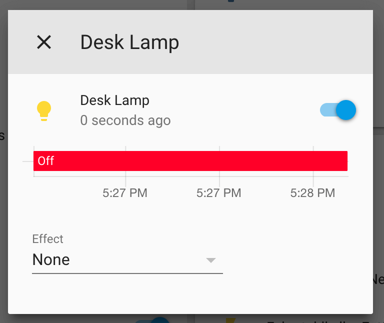

Binary Light
============

.. seo::
    :description: Instructions for setting up binary ON/OFF lights in ESPHome.
    :image: lightbulb.svg

The ``binary`` light platform creates a simple ON/OFF-only light from a
:ref:`binary output component <output>`.

.. code-block:: yaml

    # Example configuration entry
    light:
      - platform: binary
        name: "Desk Lamp"
        output: light_output

Configuration variables:
------------------------

- **output** (**Required**, :ref:`config-id`): The id of the binary :ref:`output` to use for this light.
- All other options from :ref:`Light <config-light>`.

See Also
--------

- :doc:`/docs/components/output/index`
- :doc:`/docs/components/light/index`
- :doc:`/docs/components/output/gpio`
- :doc:`/docs/components/power_supply`
- :apiref:`binary/light/binary_light_output.h`
- :ghedit:`Edit`
